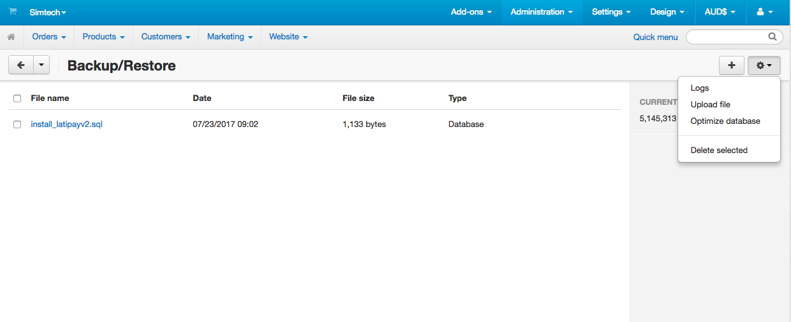

上传latipay插件文件到cs-cart网站根目录

cs-cart网站目录

访问CS-Cart网站后台http://localhost/admin.php?dispatch=datakeeper.manage

上传文件

点击齿轮图标，找到Upload file文件，上传install_latipayv2.sql文件

restore恢复install_latipayv2.sql数据库文件

配置latipay

后台访问http://localhost/admin.php?dispatch=payments.manage

Administration->Payment methods

找到latipay，点击latipay进行设置

添加latipay支付方式并设置你的User ID,Wallet ID, APi Key
